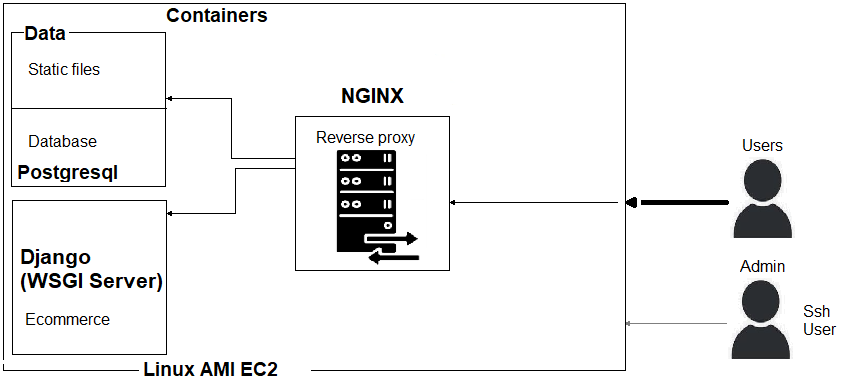

# Boilerplate Ecommerce

## Overview

The following project is an ecommerce web application.

It consists of:
- Users (clients)
- Orders
- Products

## Links

* API endpoints documentation: [here](http://ec2-3-142-237-57.us-east-2.compute.amazonaws.com/api/docs/).
* Ecommerce Web site: [here](http://ec4-statics.s3-website.us-east-2.amazonaws.com/).

## Stack and technologies

- Python and Javascript
- Django
- Django rest-framework
- AWS S3, IAM and EC2
- Reactjs
- NGINX
- Postgresql
- Pgadmin
- Docker and docker compose
- Linux alpine

## Architecture

From the system's perspective, a Linux box was created in Amazon web services. Inside three linux containers.
One as a reverse proxy, a Postgresql database and our web server. The following image describes it:



### Django container
It consists of several services working together. Django framework and django rest-framework along with uwsgi server. In general, the container has all code that covers the ecommerce business rules and more, such as the connection with the database, logic management, etc.
- Django is helpul to create and manage the so called models, to create the database tables and to present those to the users.
- Django rest-framework to create the API and endpoints.
- uwsgi is a service to run Python web applications, such as Django with NGINX server.

The following is a snippet of the container:

```yaml
FROM python:3.9-alpine3.13
LABEL maintainer="Cesar Orozco Zamora. caesar.orz@gmail.com"

ENV PYTHONUNBUFFERED 1

WORKDIR /app
COPY ./ecommerce/requirements.txt /tmp/requirements.txt
COPY ./ecommerce/requirements.txt /tmp/requirements.dev.txt
COPY ./ecommerce/scripts /scripts


ARG DEV=false
RUN python -m venv /py && \
    /py/bin/pip install --upgrade pip && \
    apk add --update --no-cache postgresql-client jpeg-dev && \
    apk add --update --no-cache --virtual .tmp-build-deps \
        build-base postgresql-dev musl-dev zlib zlib-dev linux-headers && \
    /py/bin/pip install -r /tmp/requirements.txt && \
    if [ $DEV = "true" ]; \
        then /py/bin/pip install -r /tmp/requirements.dev.txt ; \
    fi && \
    rm -rf /tmp && \
    apk del .tmp-build-deps && \
    adduser \
        --disabled-password \
        --no-create-home \
        django-user && \
    mkdir -p /vol/web/media && \
    mkdir -p /vol/web/static && \
    chown -R django-user:django-user /vol && \
    chmod -R 755 /vol && \
    chmod -R +x /scripts


COPY ./ecommerce /app/
EXPOSE 8000
ENV PATH="/scripts:/py/bin:$PATH"

USER django-user
CMD ["run.sh"]
```

The first two lines are the base docker image and the maintainer. The following four line copy the requirements (packages) and a script to run the service. The `RUN` command runs all commands, from installing linux requirements and packages, create a user called `django-user`, give some permissions to the folder `vol`, etc. Finally `COPY` copies the entire project source code, exposes port 8000, sets the linux container path for a virtual enviroment, switch to ``django-user` and run de script `run.sh`.

The script `run.sh` is a bash script. The script simple execute some task for the Django framework and finally runs the `uwsgi` server.


### Postgresql
Relational database where all tables are deployed.

This container is downloaded and executed from the docker compose file listed above.

### Proxy server
It is working as a reverse proxy. Roughly speaking, works as a bridge to serve static files and/or redirects all request from clients to the web server (uwsgi) and Django.

```yaml
FROM nginxinc/nginx-unprivileged:1-alpine
LABEL maintainer="Cesar Orozco Zamora. caesar.orz@gmail.com"

COPY default.conf.tpl /etc/nginx/default.conf.tpl
COPY uwsgi_params /etc/nginx/uwsgi_params
COPY run.sh /run.sh

ENV LISTEN_PORT=8000
ENV APP_HOST=ecommerce_api
ENV APP_PORT=9000

USER root

RUN mkdir -p /vol/static && \
    chmod 755 /vol/static && \
    touch /etc/nginx/conf.d/default.conf && \
    chown nginx:nginx /etc/nginx/conf.d/default.conf && \
    chmod +x /run.sh

VOLUME /vol/static

USER nginx

CMD ["/run.sh"]
```

Very similar to the django container. The only difference is that is listening to port `8000` (Django), get some enviroment variables as the `APP_HOST`, sets some folders for the static files and configurations, switch to `nginx` user and run the server.


### Client
The client was deployed in Amazon S3 bucket as a static web site. It was developed using React JS. Usually people deploy a website in servers, however I believe it is not neccessary due to the fact that the code is just static files being fetch by the browser in our computers. Hence, in this case the website was transformed to static files and uploaded to Amazon S3, where static files can be stored. The web browser is our final client that executes all the web site, not the servers. The model is cheap and is good enough for project like this.


<hr/>

Finally, the box that contains all the linux containers has some ports open. For now http or port 80, and ssh for controlling it remotely.
Also, all containers are managed using Docker compose. It works as a `orchestrator`. It means that docker compose creates the internal network and comunication between containers. The behavior is controlled using the following file (for production):

```yaml
version: '3.8'
services:

  ecommerce_api:
    container_name: ec_api
    build:
      context: .
      dockerfile: ./ecommerce/Dockerfile
    restart: always
    environment:
      - DB_HOST=ecommerce_db
      - DB_NAME=${DB_NAME}
      - DB_USER=${DB_USER}
      - DB_PASS=${DB_PASS}
      - SECRET_KEY=${DJANGO_SECRET_KEY}
      - DJANGO_DEBUG=${DJANGO_DEBUG}
      - ALLOWED_HOSTS=${DJANGO_ALLOWED_HOSTS}
      - CORS_ALLOWED_ORIGINS=${CORS_ALLOWED_ORIGINS}
      - AWS_KEY_ID=${AWS_KEY_ID}
      - AWS_SECRET_KEY=${AWS_SECRET_KEY}
      - AWS_BUCKET_NAME=${AWS_BUCKET_NAME}
    volumes:
      - static-data:/vol/web
    depends_on:
      - ecommerce_db

  ecommerce_db:
    container_name: ec_db
    image: postgres:13-alpine
    restart: always
    environment:
      - POSTGRES_DB=${DB_NAME}
      - POSTGRES_USER=${DB_USER}
      - POSTGRES_PASSWORD=${DB_PASS}
    ports:
      - 5432:5432
    volumes:
      - postgres-data:/var/lib/postgresql/data

  proxy:
    container_name: ec_proxy
    build:
      context: ./proxy
    restart: always
    depends_on:
      - ecommerce_api
    ports:
      - 80:8000
    volumes:
      - static-data:/vol/static

volumes:
  static-data:
  postgres-data:
```

## Deployment: Server setup

### Creating an SSH Deploy Key

To create a new SSH key which can be used as the deploy key, run the command below:

```sh
ssh-keygen -t ed25519 -b 4096
```

Note: This will create a new `ed25519` key, which is the recommended key for GitHub.

To display the public key, run:

```sh
cat ~/.ssh/id_ed25519.pub
```


### Install and Configure Dependencies

Use the below commands to configure the EC2 virtual machine running Amazon Linux 2.

Install Git:

```sh
sudo yum install git -y
```

Install Docker, make it auto start and give `ec2-user` permissions to use it:

```sh
sudo amazon-linux-extras install docker -y
sudo systemctl enable docker.service
sudo systemctl start docker.service
sudo usermod -aG docker ec2-user
```

Note: After running the above, you need to logout by typing `exit` and re-connect to the server in order for the permissions to come into effect.

Install Docker Compose:

```sh
sudo curl -L "https://github.com/docker/compose/releases/download/1.29.1/docker-compose-$(uname -s)-$(uname -m)" -o /usr/local/bin/docker-compose
sudo chmod +x /usr/local/bin/docker-compose
```


### Running Docker Service


#### Cloning Code

Use Git to clone your project:

```sh
git clone <project ssh url>
```

Note: Ensure you create an `.env` file before starting the service.


#### Running Service

To start the service, run:

```sh
docker-compose -f docker-compose-deploy.yml up -d
```

#### Stopping Service

To stop the service, run:

```sh
docker-compose -f docker-compose-deploy.yml down
```

To stop service and **remove all data**, run:

```sh
docker-compose -f docker-compose-deploy.yml down --volumes
```


#### Viewing Logs

To view container logs, run:

```sh
docker-compose -f docker-compose-deploy.yml logs
```

Add the `-f` to the end of the command to follow the log output as they come in.


#### Updating App

If you push new versions, pull new changes to the server by running the following command:

```
git pull origin
```

Then, re-build the `app` image so it includes the latest code by running:

```sh
docker-compose -f docker-compose-deploy.yml build app
```

To apply the update, run:

```sh
docker-compose -f docker-compose-deploy.yml up --no-deps -d app
```

The `--no-deps -d` ensures that the dependant services (such as `proxy`) do not restart.


### Final thoughts

This project is being updated to recent versions of software and technologies,

We have future improvements:

1. Move to ECS or ECR.
2. Create a DevOps pipeline with a tool such as terraform (Tofu is a new open source version).
3. Prepopulate the database.
4. Split this project in microservices.
5. Make it asynchonoues and a real time with websockets.
6. Deploy it using a custom domain and CloudFront or something similar to make it faster.


